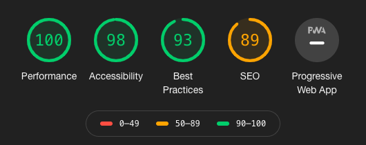

[](https://app.netlify.com/sites/redhat-developer-design-manual/deploys)

[](https://github.com/redhat-developer/design-manual/blob/master/CHANGELOG.md)
[](https://github.com/redhat-developer/design-manual/releases)

[](https://github.com/redhat-developer/design-manual/issues)
[](https://github.com/redhat-developer/design-manual/compare)

# RHDDX Frontend Documentation Site
RHDDX is short for Red Hat Developer Design Experience.
This repository contains examples of components and assemblies used on the [developers.redhat.com](https://developers.redhat.com) site.

The RHDDX documentation site is built using Jamstack (JavaScript, APIs, and Markup) technologies ([What is Jamstack?](https://jamstack.org/)) Specifically, we use the technologies recommended by [Netlify CMS - Jekyll](https://www.netlifycms.org/docs/jekyll/).

## Info

This is an ongoing project and I welcome contributions. Feel free to [file an issue](https://github.com/redhat-developer/design-manual/issues/new) or submit a PR against an existing issue.

If you wish to contribute to this project, you should fork the project under your own account, and then raise any changes via pull requests.

Any and all changes must be approved by a member of the developers.redhat.com team.

## Helpful Links
  - [GitHub Repo for developers.redhat.com](https://github.com/redhat-developer/developers.redhat.com)
    - submodule included in this project - styles for examples components/pages are located here
  - [CodePen Templates](https://codepen.io/collection/AEwLNY)
    - live starter templates for a select number of components and pages
  - [CodePen Examples](help/codepen-examples)
    - Embedded CodePen examples

## Getting started

All processes are controlled through Node/Gulp. Additionally, Jekyll requires that Ruby be installed. If you do not have these installed, you will need to do so before developing for this project. For Ruby, it is recommended to use [RVM](https://rvm.io/).

Requirements:
 - [Node (10+)](https://nodejs.org/en/)
    - _[NVM](https://nodejs.org/en/download/package-manager/#nvm) is recommended_
 - NPM (6+)
 - [Gulp](https://gulpjs.com/)
   - CLI: 2.2.0
   - Local: 4.0.2
 - Ruby (2.6+ - for Jekyll)

### Fork and Clone the Repository
```bash
git clone git@github.com:YOUR_USER_NAME/rhddx.git
cd rhddx
git remote add -f upstream git@github.com:redhat-developer/design-manual.git
```

### Initialize the Git Submodule (developers.redhat.com)

In order to build the project with the Red Hat Developer styles, you will need to initialize the developers.redhat.com submodule. You do so by running the `submodule.sh` file in the `scripts/` folder:
```bash
$ scripts/./submodule.sh
```

  _This will connect the submodule to the repo using the `.gitsubmodules` file, update the submodule, and install any necessary dependencies. It will then return you to the project root._

#### NOTE
If you will be working on the RHDDX project for a long period of time, you will want to periodically pull in updates for the submodule in order to keep everything in sync. You can easily check and apply updates using the same `submodule.sh` script.

After updating, you should see `modified:   developers.redhat.com (new commits)` when you check the `git status`. You can then add the updated submodule to your fork but running `git add .` and `git commit -m "Update submodule"`.

## Building the Project

After you have connected the developers.redhat.com submodule, you can then build the site.
```bash
# Install devDependencies
npm install

# Run Gulp Build
gulp build
```

After the initial build, you can then run the local development environment by running either `gulp development` or `scripts/./development.sh`.

  - When in development mode, Gulp will watch the project folders for changes. Changes to `.scss` files will rebuild the styles and update the `main.css` file under `_site/assets/`. Changes to any `.html` files will kick of the Jekyll Build process, updating the HTML files under `_site/`

  - To view the site locally, navigate to [localhost:4000/design-manual](http://localhost:4000/design-manual).

### Run Netlify locally (optional)

If you would like to run the build using Netlify's local configuration, you can utilize their built-in CLI and development scripts:
```bash
# Install the Netlify CLI
npm install netlify-cli -g

# Start Netlify dev
netlify dev
```

  - When running [Netlify locally](https://www.netlify.com/products/dev/), you can stream your dev server to a URL that you can then share. This is best used for local, collaborative development.

### **All Available Scripts**

```bash
  # Initializes and checks for updates to the git submodule
  scripts/./submodule.sh

  # Runs the development processes
  scripts/./development.sh

  # Run Release processes, update Changelog & push to Master
  # replace {{version}} with either major, minor, patch or prerelease
  scripts/./release.sh {{version}}
````

## Page construction

Each page under is built using Jekyll Frontmatter. Due to the size and complexity of this site, we use multiple variations of the Frontmatter in order to properly sort and render the various examples and documentation. To view how to build a page, check out the [page construction](help/page-construction) file.

## Browser support

RHDDX is supported on the latest version of the following browsers:

 - Chrome
 - Firefox
 - Safari
 - Edge (Chromium)

## Performance

### Time to First Byte
You can test the demo site's TTFB (Time To First Byte) at [testmysite.io](https://testmysite.io/5b50abe51f12b74b81dd5442/rhddx.netlify.com)

### Lighthouse Scores
**Desktop**



----

[](https://GitHub.com/redhat-developer/design-manual)

[](https://github.com/topics/git)
[](https://github.com/topics/html)
[](https://github.com/topics/css)
